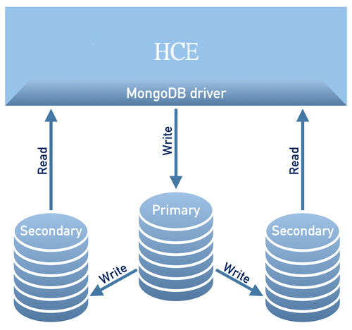
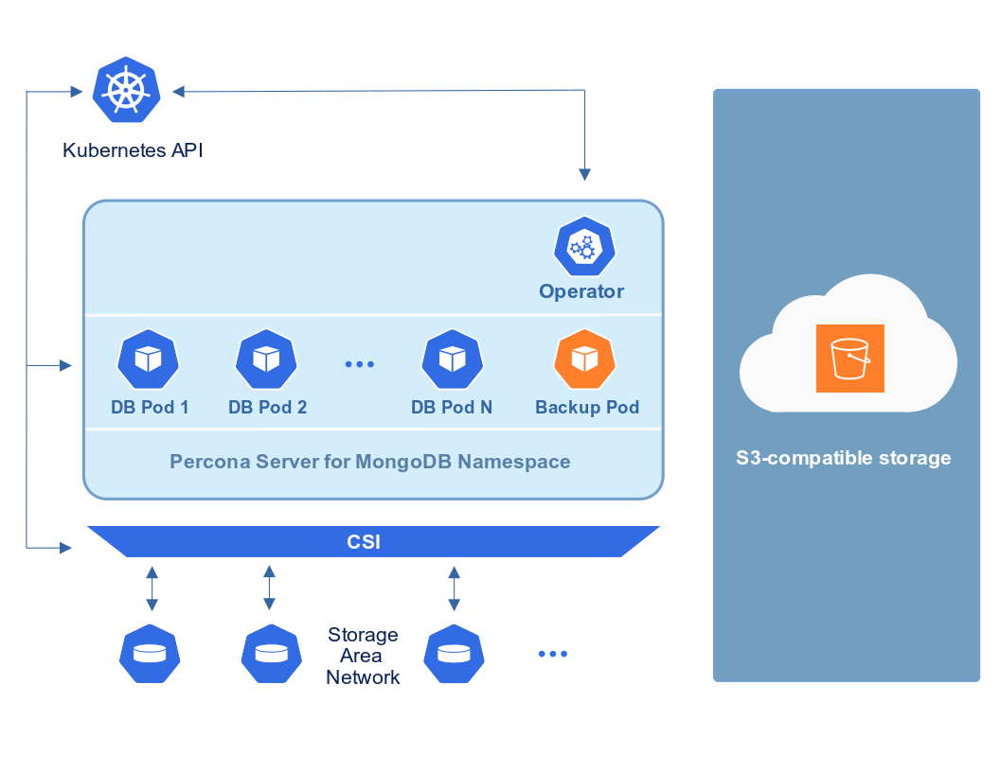

# HCE-Percona MongoDb Operator Integration
Based on the best practices for deployment and configuration, Percona Distribution for MongoDB Operator contains everything we need to quickly and consistently deploy and scale Percona Server for MongoDB instances into a Kubernetes cluster on-premises or in the cloud.The Operator contains the necessary Kubernetes settings to maintain a consistent Percona Server for MongoDB instance and for modification or deletion of items in your Percona Server for MongoDB environment. 

- You can create a Percona Server for MongoDB environment with no single point of failure and the ability to span multiple activity or availability zones.

- You can scale horizontally with sharding or by altering the size of the nodes in the replica set through Custom Resource options.

- You can configure MongoDB cluster backups to run on a scheduled basis. Backups are stored on an external S3-compatible object storage.

- You can Rely on support for data encryption in transit.

- You can rely on the self healing capability to automatically recover from failure of a single Percona Server for MongoDB node.

- It can access information from a private registry to enhance security.

## Design overview

The design of the Operator is tightly bound to the Percona Server for MongoDB replica set, which is briefly described in the following diagram.



A replica set consists of one primary server and several secondary ones (two in the picture), and the HCE  accesses the servers via a driver.
To provide high availability the Operator uses node affinity to run MongoDB instances on separate worker nodes if possible, and the database cluster is deployed as a single Replica Set with at least three nodes. If a node fails, the pod with the mongod process is automatically re-created on another node. If the failed node was hosting the primary server, the replica set initiates elections to select a new primary. If the failed node was running the Operator, Kubernetes will restart the Operator on another node, so normal operation will not be interrupted.

## Steps to Install percona MongoDB for HCE:

- Install the CRDs for Percona Server for MongoDB. The Custom Resource Definition extends the standard set of resources which Kubernetes “knows” about with the new items. In our case these items are the core of the operator.
```bash
Kubectl apply -f https://hce.chaosnative.com/manifests/latest/percona-mongo/percona-mongodb-crd.yaml
```

Output:
```bash
customresourcedefinition.apiextensions.k8s.io/perconaservermongodbs.psmdb.percona.com created
customresourcedefinition.apiextensions.k8s.io/perconaservermongodbbackups.psmdb.percona.com created
customresourcedefinition.apiextensions.k8s.io/perconaservermongodbrestores.psmdb.percona.com created
```
-  Setting up the RBAC  for Percona server for MongoDB\
**Note:** Setting RBAC requires your user to have cluster-admin role privileges
```bash
 Kubectl apply -f https://hce.chaosnative.com/manifests/latest/percona-mongo/percona-mongodb-rbac.yaml
```
Output:
```bash
role.rbac.authorization.k8s.io/percona-server-mongodb-operator created
serviceaccount/percona-server-mongodb-operator created
rolebinding.rbac.authorization.k8s.io/service-account-percona-server-mongodb-operator created
```
- Starting the Percona operator
```bash
kubectl apply -f https://hce.chaosnative.com/manifests/latest/percona-mongo/percona-operator.yaml
```
Output:
```bash
deployment.apps/percona-server-mongodb-operator created

[root@ip-172-31-44-227 percona-mongodb]# kubectl get po -n litmus
NAME                                               READY   STATUS    RESTARTS   AGE
percona-server-mongodb-operator-5dd88ff7f7-9n2ql   1/1     Running   0          15s

```
- Create MongoDb User secret and also create the secret for the s3 object, If you are willing to take the backup of db.
```bash
Kubectl apply -f  https://hce.chaosnative.com/manifests/latest/percona-mongo/percona-secret.yaml
```
Output:
```bash
secret/mongo-secrets created
secret/my-cluster-name-backup-s3 created
```
- The creation process may take some time. The process is over when all Pods have reached their Running status. You can check it with the following command:
```bash
[root@ip-172-31-44-227 percona-mongodb]# kubectl get po -n litmus
NAME                                                     READY   STATUS      RESTARTS   AGE
mongo-cluster-cfg-0                                      2/2     Running     0          5m25s
mongo-cluster-cfg-1                                      2/2     Running     0          4m46s
mongo-cluster-cfg-2                                      2/2     Running     0          4m4s
mongo-cluster-mongos-758b77985b-fv9p8                    1/1     Running     0          3m16s
mongo-cluster-mongos-758b77985b-g2mnt                    1/1     Running     0          3m16s
mongo-cluster-rs0-0                                      2/2     Running     0          5m25s
mongo-cluster-rs0-1                                      2/2     Running     0          4m46s
mongo-cluster-rs0-2                                      2/2     Running     0          4m7s
mongo-cluster-rs1-0                                      2/2     Running     0          5m25s
mongo-cluster-rs1-1                                      2/2     Running     0          4m43s
mongo-cluster-rs1-2                                      2/2     Running     0          4m4s
percona-server-mongodb-operator-5dd88ff7f7-9n2ql         1/1     Running     0          11m
```
- Install the latest released version of HCE
```bash
Kubectl apply -f  https://hce.chaosnative.com/manifests/latest/percona-mongo/hce-cluster-scope.yaml 
```
Output:
```bash
clusterrole.rbac.authorization.k8s.io/argo-cr-for-litmusportal-server created
clusterrolebinding.rbac.authorization.k8s.io/argo-crb-for-litmusportal-server 
clusterrole.rbac.authorization.k8s.io/litmus-cluster-scope-for-litmusportal-server created
clusterrolebinding.rbac.authorization.k8s.io/litmus-cluster-scope-crb-for-litmusportal-server created
clusterrole.rbac.authorization.k8s.io/litmus-admin-cr-for-litmusportal-server created
clusterrolebinding.rbac.authorization.k8s.io/litmus-admin-crb-for-litmusportal-server created
clusterrole.rbac.authorization.k8s.io/chaos-cr-for-litmusportal-server created
clusterrolebinding.rbac.authorization.k8s.io/chaos-crb-for-litmusportal-server created
clusterrole.rbac.authorization.k8s.io/subscriber-cr-for-litmusportal-server created
clusterrolebinding.rbac.authorization.k8s.io/subscriber-crb-for-litmusportal-server created
clusterrole.rbac.authorization.k8s.io/event-tracker-cr-for-litmusportal-server created
clusterrolebinding.rbac.authorization.k8s.io/event-tracker-crb-for-litmusportal-server created
clusterrole.rbac.authorization.k8s.io/litmus-server-cr created
clusterrolebinding.rbac.authorization.k8s.io/litmus-server-crb created
clusterrole.rbac.authorization.k8s.io/license-server-cluster-role created
clusterrolebinding.rbac.authorization.k8s.io/license-server-cluster-role-binding created
serviceaccount/license-server-account created
serviceaccount/litmus-server-account created
secret/litmus-portal-admin-secret configured
secret/regcred created
configmap/litmus-portal-admin-config configured
configmap/litmusportal-frontend-nginx-configuration created
deployment.apps/license-server configured
service/license-service created
deployment.apps/litmusportal-frontend configured
service/litmusportal-frontend-service created
deployment.apps/litmusportal-server configured
service/litmusportal-server-service created
deployment.apps/litmusportal-auth-server configured
service/litmusportal-auth-server-service created
```
- Check the status of all the pods
```bash
kubectl get po -n litmus
```
Output:
```
NAME                                               READY   STATUS    RESTARTS   AGE
license-server-fd746bf75-n2d5z                     1/1     Running   0          3m11s
litmusportal-auth-server-848c7cf78-jsw79           1/1     Running   0          3m8s
litmusportal-frontend-7f89f89d87-lz4wn             1/1     Running   0          7m38s
litmusportal-server-77594dc996-jl8cf               1/1     Running   0          3m9s
mongo-cluster-cfg-0                                1/1     Running   0          8m50s
mongo-cluster-cfg-1                                1/1     Running   0          8m18s
mongo-cluster-mongos-656fc5588f-g7txq              1/1     Running   0          7m21s
mongo-cluster-mongos-656fc5588f-xtsx2              1/1     Running   0          35s
mongo-cluster-rs0-0                                1/1     Running   0          8m49s
mongo-cluster-rs0-1                                1/1     Running   0          8m18s
mongo-cluster-rs1-0                                1/1     Running   0          8m49s
mongo-cluster-rs1-1                                1/1     Running   0          8m18s
percona-server-mongodb-operator-57cdd66f6c-9rzg5   1/1     Running   0          10m
```
**Note:**  For HA and Faster I/O Operation you can have 2 shards with atleast 3 replicasets and 3 config server.

### Backup:
Percona Backup for MongoDB is a distributed, low-impact solution for achieving consistent backups of MongoDB sharded clusters and replica sets
The Operator usually stores Server for MongoDB backups outside the Kubernetes cluster: on Amazon S3 or S3-compatible storage, or on Azure Blob Storage.



Here You can find the example  which uses  Amazon S3 for Backup
```bash
  backup:
    enabled: true
    restartOnFailure: true
    image: percona/percona-server-mongodb-operator:1.11.0-backup
    serviceAccountName: percona-server-mongodb-operator
    storages:
      s3-us-east:
       type: s3
       s3:
         bucket: pecona-backup-test
         credentialsSecret: my-cluster-name-backup-s3
         region: us-east-1
         prefix: ""
    tasks:
    - name: "every-5-min-backup"
      enabled: true
      schedule: "*/5 * * * *"
      keep: 3
      storageName: s3-us-east
```

If you want point In time Backup, You can follow [this](https://github.com/chaosnative/hce-charts/blob/main/k8s-manifests/percona-mongo/percona-backup.yaml) manifest: 

### Restore
To restore you can  follow [this](https://github.com/chaosnative/hce-charts/blob/percona/k8s-manifests/main/percona-backup-restore.yaml) manifest.
